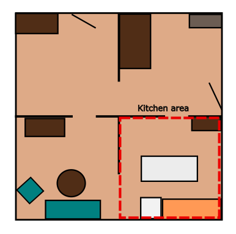

# Eindhoven2024

## Table of Contents

- [Scores](#scores)
- [Schedule](#schedule)
- [Arenas](#arenas)
- [Stage 1](#stage-1)
    + [Receptionist](#receptionist)
    + [Storing Groceries](#storing-groceries)
    + [Carry my Luggage](#carry-my-luggage)
    + [Serve Breakfast](#serve-breakfast)
    + [GPSR](#gpsr)
- [Stage 2](#stage-2)
    + [Clean the Table](#clean-the-table)
    + [Stickler for the Rules](#stickler-for-the-rules)
    + [EGPSR](#egpsr)

## Scores
<!--
Team rankings and total scores from stage 1 and stage 2

OPL

|     | Team Name (ranking) | Total scores (stage 1 and 2) |
| --- | ------------------- | ---------------------------- |
| 1   |                     |                              |
| 2   |                     |                              |
| 3   |                     |                              |
| 4   |                     |                              |
| 5   |                     |                              |
| 6   |                     |                              |
| 7   |                     |                              |
| 8   |                     |                              |
| 9   |                     |                              |
| 10  |                     |                              |
| 11  |                     |                              |
| 12  |                     |                              |
| 13  |                     |                              |
| 14  |                     |                              |
| 15  |                     |                              |

DSPL

|     | Team name (ranking) | Total score (stage 1 and 2) |
| --- | ------------------- | --------------------------- |
| 1   |                     |                             |
| 2   |                     |                             |
| 3   |                     |                             |
| 4   |                     |                             |
| 5   |                     |                             |
| 6   |                     |                             |
| 7   |                     |                             |
| 8   |                     |                             |
| 9   |                     |                             |
| 10  |                     |                             |
| 11  |                     |                             |

SSPL

|     | Team name (ranking) | Stage 1 + 2 points |
| --- | ------------------- | ------------------ |
| 1   |                     |                    |
| 2   |                     |                    |
| 3   |                     |                    |
| 4   |                     |                    |
-->

## Schedule

|       | Wed July 17         | Thu July 18         | Fri July 19               | Sat July 20                         | Sun July 21    |
| ----- | ------------------- | ------------------- | ------------------------- | ----------------------------------- | -------------- |
| 09:00 |                     |                     | Serve Breakfast           | Restaurant (all teams present 8:30) |                |
| 10:00 |                     | Carry my Luggage    | Serve Breakfast           | Restaurant                          | Open challenge |
| 11:00 |                     | Carry my Luggage    |                           | Restaurant                          |                |
| 12:00 |                     |                     | GPSR                      |                                     | Final          |
| 13:00 |                     | Receptionist        | GPSR                      | Stickler for the Rules              | Final          |
| 14:00 |                     | Receptionist        | announcement second stage | Stickler for the Rules              |                |
| 15:00 | Opening Ceremony    |                     |                           |                                     |                |
| 16:00 |                     | Storing Groceries   | Clean the Table           | EGPSR                               |                |
| 17:00 | Robot Inspection    | Storing Groceries   | Clean the Table           | EGPSR                               |                |
| 18:00 |                     |                     |                           |                                     |                |
| 19:00 | Team-Leader Meeting | Team-Leader Meeting | Team-Leader Meeting       |                                     |                |
| 20:00 | Poster Reception    |                     |                           |                                     |                |

## Arenas

## Robot Inspection and Poster Session

Announce location for Poster.

## Stage 1

### Receptionist

Announce host's favorite drink
Announce host's name

### Storing Groceries

Announce which table will be used

Announce what will be used as cabinet

### Carry my Luggage

### Serve Breakfast

### GPSR

## Stage 2

### Clean the Table

### Stickler for the Rules

### EGPSR

