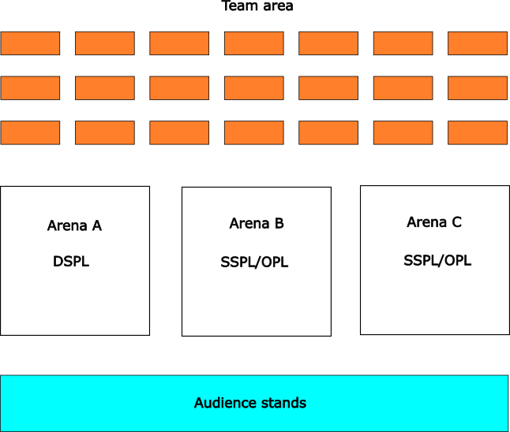

# Eindhoven2024

Join the Eindhoven 2024 Telegram group for quick announcements: https://t.me/+_BQlsF5p6LQ0MzZh

## Table of Contents

- [Scores](#scores)
- [Schedule](#schedule)
Note: Clean The Table moved to 5 pm
- [Arenas](#arenas)
- [Stage 1](#stage-1)
    + [Receptionist](#receptionist)
    + [Storing Groceries](#storing-groceries)
    + [Carry my Luggage](#carry-my-luggage)
    + [Serve Breakfast](#serve-breakfast)
    + [GPSR](#gpsr)
- [Stage 2](#stage-2)
    + [Clean the Table](#clean-the-table)
    + [Stickler for the Rules](#stickler-for-the-rules)
    + [EGPSR](#egpsr)

## Scores

### SSPL

The 2 best teams qualify for stage 2.

|Team Name|Poster|Carry My Luggage|Receptionist|Storing Groceries|Serving Breakfast|GPSR|Stage 1|
| -------- | ----- | --- | --- | --- | --- | --- | ------ |
| KIARO    | 31.09 | 0   | 0   | 0   | 0   |     | 31.09  |
| SinfonIA | 31.30 | 0   | 265 | 0   | 0   |     | 296.30 |
| SKUBA    | 24.13 | 0   | 0   | 0   | 15  |     | 39.13  |

### DSPL

The 6 best teams qualify for stage 2.

||Team Name|Poster|Carry My Luggage|Receptionist|Storing Groceries|Serving Breakfast|GPSR|Stage 1|
|---|---|---|---|---|---|---|---|---|
|1|Hibikino-Musashi@Home|34.09|665|590|570|145|550|2554.09|
|2|Tidyboy-DSPL|32.17|115|385|585|80|660|1857.17|
|3|Tech United Eindhoven|32.39|550|540|205|15|50|1392.39|
|4|eR@sers|28.86|515|195|80|15|550|1383.86|
|5|UT Austin Villa@Home|37.67|15|490|95|80|660|1377.67|
|6|TRAIL|40|50|387.5|305|15|220|1017.5|
|7|SUTURO-VaB|35.43|400|355|45|0|100|935.43|
|8|RoboCanes-VISAGE|30.87|400|355|0|15|0|800.87|
|9|rUNSWeep|30.95|0|0|15|15|15|75.95|

### OPL

The 9 best teams qualify for stage 2.

||Team Name|Poster|Carry My Luggage|Receptionist|Storing Groceries|Serving Breakfast|GPSR|Stage 1|
|---|---|---|---|---|---|---|---|---|
|1|Tidyboy-OPL|31.74|165|0|1074|1147|300|2,717.74|
|2|NimbRo@Home|38.04|265|550|15|360|900|2,128.04|
|3|Chief Scientist Office|28.41|615.00|115|405|445|130|1,738.41|
|4|SocRob@Home|36.52|115|440|45|245|850|1,731.52|
|5|SCC (Serious Cybernetcis Corporation)|38.91|465|620|15|15|300|1,453.91|
|6|LAR@Home|34.09|15|700|15|480|0|1,244.09|
|7|Gentlebots|32.81|465|455|30|0|150|1,132.81|
|8|LCASTOR|28.7|450|0|30|15|480|1,003.70|
|9|RoboFEI|30.65|0|430|290|65|0|815.65|
|10|FBOT@Home|33.91|15|580|30|30|0|688.91|
|11|ToBI (Team of Bielefeld)|38.26|115|265|15|145|0|578.26|
|12|Pumas|32.83|15|330|45|30|50|502.83|
|13|LASR|32.86|165|240|0|0|0|437.86|
|14|LyonTech|31.96|15|240|0|0|0|286.96|
|15|EPFL@Home|0.00|0.00|190|0|0||190.00|
|16|RoBorregos|30.68|0|0|0|15|0|45.68|
|17|Tinker|25.87||||0|0|25.87|

<!--
Team rankings and total scores from stage 1 and stage 2

OPL

|     | Team Name (ranking) | Total scores (stage 1 and 2) |
| --- | ------------------- | ---------------------------- |
| 1   |                     |                              |
| 2   |                     |                              |
| 3   |                     |                              |
| 4   |                     |                              |
| 5   |                     |                              |
| 6   |                     |                              |
| 7   |                     |                              |
| 8   |                     |                              |
| 9   |                     |                              |
| 10  |                     |                              |
| 11  |                     |                              |
| 12  |                     |                              |
| 13  |                     |                              |
| 14  |                     |                              |
| 15  |                     |                              |

DSPL

|     | Team name (ranking) | Total score (stage 1 and 2) |
| --- | ------------------- | --------------------------- |
| 1   |                     |                             |
| 2   |                     |                             |
| 3   |                     |                             |
| 4   |                     |                             |
| 5   |                     |                             |
| 6   |                     |                             |
| 7   |                     |                             |
| 8   |                     |                             |
| 9   |                     |                             |
| 10  |                     |                             |
| 11  |                     |                             |

SSPL

|     | Team name (ranking) | Stage 1 + 2 points |
| --- | ------------------- | ------------------ |
| 1   |                     |                    |
| 2   |                     |                    |
| 3   |                     |                    |
| 4   |                     |                    |
-->

## Schedule

|       | Tue July 16         | Wed July 17         | Thu July 18         | Fri July 19               | Sat July 20                         | Sun July 21    |
| ----- | ------------------- |-------------------- | ------------------- | ------------------------- | ----------------------------------- | -------------- |
| 09:00 |                     |                     | Carry my Luggage    | Serve Breakfast           | Restaurant (all teams present 8:30) |                |
| 10:00 |  Testslot #1        | Testslot #4         | Carry my Luggage    | Serve Breakfast           | Restaurant                          | Open challenge |
| 11:00 |  Testslot #1        | Testslot #4         | Carry my Luggage    |                           | Restaurant                          |                |
| 12:00 |                     |                     |                     | GPSR                      |                                     | Final (time pending) |
| 13:00 |  Testslot #2        |                     | Receptionist        | GPSR                      | Stickler for the Rules              | Final (time pending) |
| 14:00 |  Testslot #2        |                     | Receptionist        | announcement second stage | Stickler for the Rules              |                |
| 15:00 |                     | Opening Ceremony    |                     |                           |                                     |                |
| 16:00 |                     |                     | Storing Groceries   |                           | EGPSR                               |                |
| 17:00 |  Testslot #3        | Robot Inspection    | Storing Groceries   | Clean the Table           | EGPSR                               |                |
| 18:00 |  Testslot #3        | 18:30 Team-Leader Meeting |                     |        Clean the Table          |                                     |                |
| 19:00 | Team-Leader Meeting | 19:30 Poster Presentation (+ additional tries for Robot Inspection) | Team-Leader Meeting | Team-Leader Meeting       |                                     |                |
| 20:00 |                     | Poster Presentation & Reception    |                     |                           |                                     |                |

### Clean the Table, Fri July 19, 17:00

        
|#|Clean the Table (Arena A)|League|#|Clean the Table (Arena B,C)|League|#|Clean the Tablet (Arena C,B)|League|
|-|-|-|-|-|-|-|-|-|
|1|Tech United Eindhoven|DSPL|1|SKUBA|SSPL|1|SocRob@Home|OPL|
|2|Tidyboy-DSPL|DSPL|2|SinfonIA|SSPL|2|LCASTOR|OPL|
|3|TRAIL|DSPL|3|RoboFEI|OPL|3|Tidyboy-OPL|OPL|
|4|eR@sers|DSPL|4|SCC (Serious Cybernetcis Corporation)|OPL|4|NimbRo@Home|OPL|
|5|Hibikino-Musashi@Home|DSPL|5|LAR@Home|OPL|5|Gentlebots|OPL|
|6|UT Austin Villa@Home|DSPL|6|Chief Scientist Office|OPL||||

### Restaurant, Sat July 20, 9:00

The ordering of leagues is SSPL, DSPL, OPL.

|#|Restaurant (DSPL)|League|#|Restaurant (SSPL)|League|#|Restaurant (OPL)|League|
|-|-|-|-|-|-|-|-|-|
|1|eR@sers|DSPL|1|SinfonIA|SSPL|1|Tidyboy-OPL|OPL|
|2|Tidyboy-DSPL|DSPL|2|SKUBA|SSPL|2|LCASTOR|OPL|
|3|UT Austin Villa@Home|DSPL||||3|LAR@Home|OPL|
|4|Hibikino-Musashi@Home|DSPL||||4|SocRob@Home|OPL|
|5|Tech United Eindhoven|DSPL||||5|SCC (Serious Cybernetcis Corporation)|OPL|
|6|TRAIL|DSPL||||6|Chief Scientist Office|OPL|
|||||||7|RoboFEI|OPL|
|||||||8|NimbRo@Home|OPL|
|||||||9|Gentlebots|OPL|

### Carry my Luggage, Thu July 18, 9:00 (outside arena, teams start in two groups)

|#|Carry My Luggage (Starting Point B) |League|#|Carry My Luggage (Starting Point A) |League|
|-|-|-|-|-|-|
|1|RoBorregos|OPL|1|SKUBA|SSPL|
|2|LASR|OPL|2|KIARO|SSPL|
|3|ToBI (Team of Bielefeld)|OPL|3|SinfonIA|SSPL|
|4|SCC (Serious Cybernetcis Corporation)|OPL|4|Tidyboy-DSPL|DSPL|
|5|Tidyboy-OPL|OPL|5|eR@sers|DSPL|
|6|Chief Scientist Office|OPL|6|RoboCanes-VISAGE|DSPL|
|7|FBOT@Home|OPL|7|UT Austin Villa@Home|DSPL|
|8|LCASTOR|OPL|8|Hibikino-Musashi@Home|DSPL|
|9|LAR@Home|OPL|9|TU/e|DSPL|
|10|Pumas|OPL|10|rUNSWeep|DSPL|
|11|SOBITS|OPL|11|SUTURO-VaB|DSPL|
|12|Tinker|OPL|12|TRAIL|DSPL|
|13|LyonTech|OPL||||
|14|SocRob@Home|OPL||||
|15|EPFL@Home|OPL||||
|16|RoboFEI|OPL||||
|17|NimbRo@Home|OPL||||
|18|Gentlebots|OPL||||

### Receptionist, Thu July 18, 13:00

|#|Receptionist (Arena A)|League|#|Receptionist (Arena B,C)|League|#|Receptionist (Arena C,B)|League|
|-|-|-|-|-|-|-|-|-|
|1|SUTURO-VaB|DSPL|1|SinfonIA|SSPL|1|Gentlebots|OPL|
|2|eR@sers|DSPL|2|SKUBA|SSPL|2|Tidyboy-OPL|OPL|
|3|RoboCanes-VISAGE|DSPL|3|KIARO|SSPL|3|LyonTech|OPL|
|4|Tidyboy-DSPL|DSPL|4|LASR|OPL|4|RoboFEI|OPL|
|5|TU/e|DSPL|5|Tinker|OPL|5|Chief Scientist Office|OPL|
|6|UT Austin Villa@Home|DSPL|6|Pumas|OPL|6|NimbRo@Home|OPL|
|7|Hibikino-Musashi@Home|DSPL|7|LCASTOR|OPL|7|ToBI (Team of Bielefeld)|OPL|
|8|rUNSWeep|DSPL|8|SCC (Serious Cybernetcis Corporation)|OPL|8|SocRob@Home|OPL|
|9|TRAIL|DSPL|9|SOBITS|OPL|9|FBOT@Home|OPL|
||||10|LAR@Home|OPL|10|EPFL@Home|OPL|
||||11|RoBorregos|OPL||||

### Storing Groceries, Thu July 18, 16:00

|#|Storing Groceries (Arena A)|League|#|Storing Groceries (Arena B,C)|League|#|Storing Groceries (Arena C,B)|League|
|-|-|-|-|-|-|-|-|-|
|1|RoboCanes-VISAGE|DSPL|1|~~KIARO~~|SSPL|1|NimbRo@Home|OPL|
|2|UT Austin Villa@Home|DSPL|2|SinfonIA|SSPL|2|SocRob@Home|OPL|
|3|SUTURO-VaB|DSPL|3|SKUBA|SSPL|3|Tidyboy-OPL|OPL|
|4|Tidyboy-DSPL|DSPL|4|~~LyonTech~~|OPL|4|ToBI (Team of Bielefeld)|OPL|
|5|TU/e|DSPL|5|RoboFEI|OPL|5|SOBITS|OPL|
|6|TRAIL|DSPL|6|LAR@Home|OPL|6|SCC (Serious Cybernetcis Corporation)|OPL|
|7|rUNSWeep|DSPL|7|Tinker|OPL|7|~~EPFL@Home~~|OPL|
|8|eR@sers|DSPL|8|RoBorregos|OPL|8|Chief Scientist Office|OPL|
|9|Hibikino-Musashi@Home|DSPL|9|Gentlebots|OPL|9|FBOT@Home|OPL|
||||10|LCASTOR|OPL|10|~~LASR~~|OPL|
||||11|Pumas|OPL||||

### Serve Breakfast, Fri July 19, 09:00 

|#|Serve Breakfast (Arena A)|League|#|Serve Breakfast (Arena B,C)|League|#|Serve Breakfast (Arena C,B)|League|
|-|-|-|-|-|-|-|-|-|
|1|UT Austin Villa@Home|DSPL|1|SKUBA|SSPL|1|Pumas|OPL|
|2|rUNSWeep|DSPL|2|~~KIARO~~|SSPL|2|Tinker|OPL|
|3|Tidyboy-DSPL|DSPL|3|~~SinfonIA~~|SSPL|3|ToBI (Team of Bielefeld)|OPL|
|4|TU/e|DSPL|4|FBOT@Home|OPL|4|SOBITS|OPL|
|5|RoboCanes-VISAGE|DSPL|5|SCC (Serious Cybernetcis Corporation)|OPL|5|~~LASR~~|OPL|
|6|SUTURO-VaB|DSPL|6|RoBorregos|OPL|6|NimbRo@Home|OPL|
|7|eR@sers|DSPL|7|LCASTOR|OPL|7|Tidyboy-OPL|OPL|
|8|TRAIL|DSPL|8|SocRob@Home|OPL|8|Chief Scientist Office|OPL|
|9|Hibikino-Musashi@Home|DSPL|9|~~Gentlebots~~|OPL|9|LAR@Home|OPL|
||||10|~~LyonTech~~|OPL|10|~~EPFL@Home~~|OPL|
||||11|RoboFEI|OPL||||

### General Purpose Service Robot (GPSR), Fri July 12:00

|#|GPSR (Arena A)|League|#|GPSR (Arena B,C)|League|#|GPSR (Arena C,B)|League|
|-|-|-|-|-|-|-|-|-|
|1|TRAIL|DSPL|1|SinfonIA|SSPL|1|Chief Scientist Office|OPL|
|2|rUNSWeep (Serve Breakfast)|DSPL|2|~~KIARO (Receptionist)~~|SSPL|2|~~EPFL@Home~~|OPL|
|3|UT Austin Villa@Home|DSPL|3|SKUBA|SSPL|3|LAR@Home|OPL|
|4|Tidyboy-DSPL|DSPL|4|SCC (Serious Cybern etcis Corporation)|OPL|4|Tidyboy-OPL|OPL|
|5|RoboCanes-VISAGE|DSPL|5|NimbRo@Home|OPL|5|LyonTech (Receptionist)|OPL|
|6|Hibikino-Musashi@Home|DSPL|6|SocRob@Home|OPL|6|LCASTOR|OPL|
|7|eR@sers|DSPL|7|FBOT@Home (Receptionist)|OPL|7|RoBorregos (Serve Breakfast)|OPL|
|8|SUTURO-VaB|DSPL|8|LASR|OPL|8|RoboFEI|OPL|
|9|TU/e|DSPL|9|Gentlebots|OPL|9|Pumas|OPL|
||||10|Tinker (Receptionist)|OPL|10|SOBITS|OPL|
||||11|ToBI (Team of Bielefeld)|OPL||||

### Testslots & Robot Inspection

#### Arena A (DSPL)

|#|Testslot#1 (Arena A), 7/16/24 10:00|League|#|Testslot#2 (Arena A), 7/16/24 13:00|League|#|Testslot#3 (Arena A), 7/16/24 17:00|League|#|Testslot#4 (Arena A), 7/17/24 10:00|League|#|Robot Inspection (Arena A), 7/17/24 17:00|League|
|-|-|-|-|-|-|-|-|-|-|-|-|-|-|-|
|1|Tidyboy-DSPL|DSPL|1|Tidyboy-DSPL|DSPL|1|Hibikino-Musashi@Home|DSPL|1|Hibikino-Musashi@Home|DSPL|1|Hibikino-Musashi@Home|DSPL|
|2|eR@sers|DSPL|2|eR@sers|DSPL|2|Tidyboy-DSPL|DSPL|2|Tidyboy-DSPL|DSPL|2|Tidyboy-DSPL|DSPL|
|3|RoboCanes-VISAGE|DSPL|3|RoboCanes-VISAGE|DSPL|3|SUTURO-VaB|DSPL|3|SUTURO-VaB|DSPL|3|SUTURO-VaB|DSPL|
|4|UT Austin Villa@Home|DSPL|4|UT Austin Villa@Home|DSPL|4|eR@sers|DSPL|4|eR@sers|DSPL|4|eR@sers|DSPL|
|5|Hibikino-Musashi@Home|DSPL|5|Hibikino-Musashi@Home|DSPL|5|RoboCanes-VISAGE|DSPL|5|RoboCanes-VISAGE|DSPL|5|RoboCanes-VISAGE|DSPL|
|6|TU/e|DSPL|6|TU/e|DSPL|6|TU/e|DSPL|6|TU/e|DSPL|6|TU/e|DSPL|
|7|rUNSWeep|DSPL|7|rUNSWeep|DSPL|7|TRAIL|DSPL|7|TRAIL|DSPL|7|TRAIL|DSPL|
|8|SUTURO-VaB|DSPL|8|SUTURO-VaB|DSPL|8|rUNSWeep|DSPL|8|rUNSWeep|DSPL|8|rUNSWeep|DSPL|
|9|TRAIL|DSPL|9|TRAIL|DSPL|9|UT Austin Villa@Home|DSPL|9|UT Austin Villa@Home|DSPL|9|UT Austin Villa@Home|DSPL|

#### Arena B (SSPL + OPL)

|#|Testslot#1 (Arena B), 7/16/24 10:00|League|#|Testslot#2 (Arena B), 7/16/24 13:00|League|#|Testslot#3 (Arena B), 7/16/24 17:00|League|#|Testslot#4 (Arena B), 7/17/24 10:00|League|#|Robot Inspection (Arena B), 7/17/24 17:00|League|
|-|-|-|-|-|-|-|-|-|-|-|-|-|-|-|
|1|SKUBA|SSPL|1|RoBorregos|OPL|1|LCASTOR|OPL|1|SKUBA|SSPL|1|SKUBA|SSPL|
|2|KIARO|SSPL|2|LASR|OPL|2|Tinker|OPL|2|SinfonIA|SSPL|2|SinfonIA|SSPL|
|3|SinfonIA|SSPL|3|ToBI (Team of Bielefeld)|OPL|3|LAR@Home|OPL|3|KIARO|SSPL|3|KIARO|SSPL|
|4|SOBITS|OPL|4|SCC (Serious Cybernetcis Corporation)|OPL|4|SocRob@Home|OPL|4|Gentlebots|OPL|4|Gentlebots|OPL|
|5|Tinker|OPL|5|Tidyboy-OPL|OPL|5|EPFL@Home|OPL|5|Chief Scientist Office|OPL|5|Chief Scientist Office|OPL|
|6|LyonTech|OPL|6|Chief Scientist Office|OPL|6|SOBITS|OPL|6|FBOT@Home|OPL|6|FBOT@Home|OPL|
|7|SocRob@Home|OPL|7|FBOT@Home|OPL|7|Tidyboy-OPL|OPL|7|LASR|OPL|7|LASR|OPL|
|8|EPFL@Home|OPL|8|LCASTOR|OPL|8|RoboFEI|OPL|8|Pumas|OPL|8|Pumas|OPL|
|9|RoboFEI|OPL|9|LAR@Home|OPL|9|NimbRo@Home|OPL|9|ToBI (Team of Bielefeld)|OPL|9|ToBI (Team of Bielefeld)|OPL|
|10|NimbRo@Home|OPL|10|Pumas|OPL|10|RoBorregos|OPL|10|LyonTech|OPL|10|LyonTech|OPL|
|11|Gentlebots|OPL|11|||11|||11|SCC (Serious Cybernetcis Corporation)|OPL|11|SCC (Serious Cybernetcis Corporation)|OPL|

#### Arena C (OPL + SSPL)

|#|Testslot#1 (Arena C), 7/16/24 10:00|League|#|Testslot#2 (Arena C), 7/16/24 13:00|League|#|Testslot#3 (Arena C), 7/16/24 17:00|League|#|Testslot#4 (Arena C), 7/17/24 10:00|League|#|Robot Inspection (Arena C), 7/17/24 17:00|League|
|-|-|-|-|-|-|-|-|-|-|-|-|-|-|-|
|1|RoBorregos|OPL|1|SKUBA|SSPL|1|SKUBA|SSPL|1|LCASTOR|OPL|1|LCASTOR|OPL|
|2|LASR|OPL|2|KIARO|SSPL|2|SinfonIA|SSPL|2|Tinker|OPL|2|Tinker|OPL|
|3|ToBI (Team of Bielefeld)|OPL|3|SinfonIA|SSPL|3|KIARO|SSPL|3|LAR@Home|OPL|3|LAR@Home|OPL|
|4|SCC (Serious Cybernetcis Corporation)|OPL|4|SOBITS|OPL|4|Gentlebots|OPL|4|SocRob@Home|OPL|4|SocRob@Home|OPL|
|5|Tidyboy-OPL|OPL|5|Tinker|OPL|5|Chief Scientist Office|OPL|5|EPFL@Home|OPL|5|EPFL@Home|OPL|
|6|Chief Scientist Office|OPL|6|LyonTech|OPL|6|FBOT@Home|OPL|6|SOBITS|OPL|6|SOBITS|OPL|
|7|FBOT@Home|OPL|7|SocRob@Home|OPL|7|LASR|OPL|7|Tidyboy-OPL|OPL|7|Tidyboy-OPL|OPL|
|8|LCASTOR|OPL|8|EPFL@Home|OPL|8|Pumas|OPL|8|RoboFEI|OPL|8|RoboFEI|OPL|
|9|LAR@Home|OPL|9|RoboFEI|OPL|9|ToBI (Team of Bielefeld)|OPL|9|NimbRo@Home|OPL|9|NimbRo@Home|OPL|
|10|Pumas|OPL|10|NimbRo@Home|OPL|10|LyonTech|OPL|10|RoBorregos|OPL|10|RoBorregos|OPL|
|11|||11|Gentlebots|OPL|11|SCC (Serious Cybernetcis Corporation)|OPL|11|||11|||

#### Team Area Floorplan

## Arenas

| Number | Name  | Object Category
| ------------ | ----------- | ----------- |
| 1 | hallway cabinet (p) |
| 2 | entrance |
| 3 | desk (p) | decorations |
| 4 | shelf (p) | cleaning supplies |
| 5 | coathanger |
| 6 | exit |
| 7 | TV table (p) | toys |
| 8 | lounge chair |
| 9 | lamp |
| 10 | couch |
| 11 | coffee table (p) | fruits |
| 12 | trashcan | 
| 13 | kitchen cabinet (p) | drinks |
| 14 | dinner table (p) | snacks |
| 15 | dishwasher (p) | dishes |
| 16 | kitchen counter (p) | food |

(p) indicated whether objects can be placed at the location

## Robot Inspection and Poster Session

Announce location for Poster.

## Stage 1

### Receptionist

Host's favorite drink: Milk
Host's name: John

### Storing Groceries

Dinner table will be used as table

Kitchen cabinet will be used as cabinet

### Carry my Luggage

### GPSR

## Stage 2

### Clean the Table

### Stickler for the Rules

## Volunteer Requirements

Each team with 6+ members needs to supply some volunteer(s) for the tasks. Please make sure your volunteer (does not have to be a team member necessarily) is at the appointed location (see table) **10 minutes** before the specified task starts!

|                            | Thu 9-12             | Thu 13-15        | Fr 12-14 | Sa 9-12        | Sa 13-15                   | Sa 16-18  |
| -------------------------- | -------------------- | ---------------- | -------- | -------------- | -------------------------- | --------- |
|                            | **Carry My Luggage** | **Receptionist** | **GPSR** | **Restaurant** | **Stickler for the Rules** | **EGPSR** |
| **SUTURO-VaB**             | Arena C              |                  | Arena B  | Restaurant     |                            | Arena B   |
| **Hibikino-Musashi@Home**  | Arena B              | Arena B          |          | Restaurant     |                            | Arena C   |
| **Tidyboy-OPL**            | Arena A              |                  | Arena C  |                | Arena A                    |           |
| **Tidyboy-DSPL**           | Arena B              |                  | Arena B  |                |                            | Arena A   |
| **LASR**                   | Arena C              |                  | Arena A  |                | Arena C                    |           |
| **Pumas-OPL**              | Arena B              |                  | Arena A  |                | Arena A                    |           |
| **Tinker**                 |                      | Arena A          |          | Restaurant     |                            | Arena C   |
| **ToBi**                   | Arena A              |                  |          | Restaurant     | Arena B                    |           |
| **TRAIL**                  |                      |                  | Arena C  |                | Arena B                    |           |
| **Gentlebots**             | Arena C              |                  |          | Restaurant     |                            |           |
| **NimbRo**                 |                      | Arena A          |          |                | Arena A                    |           |
| **SocRob**                 | Arena A              |                  |          |                | Arena C                    |           |
| **eRasers**                |                      | Arena C          |          |                | Arena A                    |           |
| **Chief Scientist Office** |                      | Arena B          |          |                | Arena C                    |           |
| **LCASTOR**                |                      | Arena C          |          | Restaurant     |                            |           |
| **LyonTech**               |                      |                  |          | Restaurant     |                            | Arena A   |
| **KIARO**                  |                      |                  |          | Restaurant     |                            | Arena B   |
| **FBOT**                   |                      |                  |          |                | Arena C                    |           |
| **LAR**                    |                      |                  |          |                | Arena B                    |           |
| **RoboFEI**                |                      |                  |          | Restaurant     |                            |           |
| **SCC**                    |                      |                  |          |                | Arena B                    |           |
